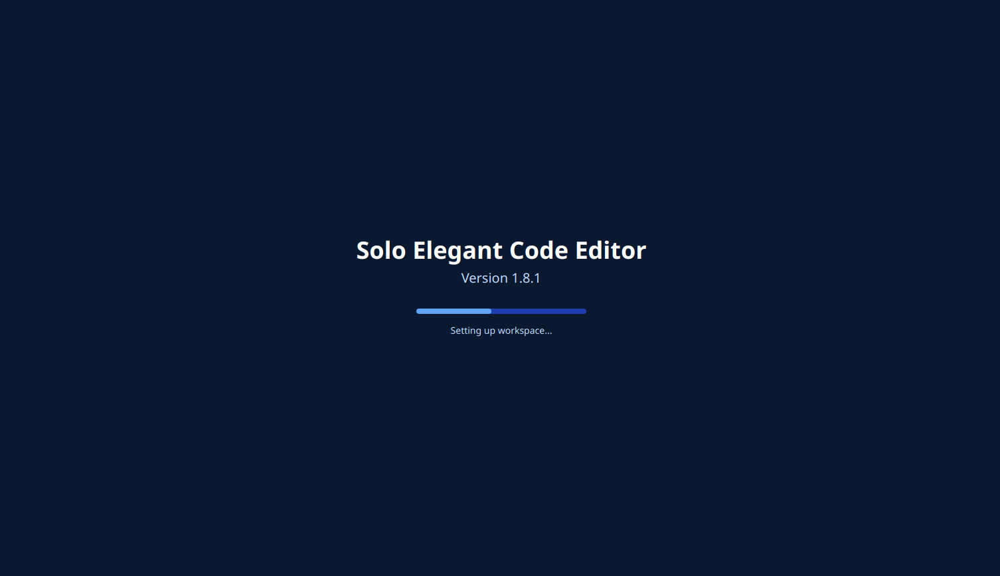

# Solo Elegant Code Editor

A lightweight, elegant code editor for the web with syntax highlighting, multiple language support, and various export options.




## Features

- **Syntax Highlighting** for 20+ programming languages
- **Dark/Light Theme** switching with system preference detection
- **Line Numbering** with synchronous scrolling
- **Export Options**:
  - Direct download as a code file with appropriate extension
  - Screenshot generation of the editor
  - PDF export with code formatting
- **Sharing** via URL with encoded content
- **Auto-save** functionality to prevent loss of work
- **Stats Display** showing line, column, character count, and word count
- **Responsive Design** that works on various screen sizes

## Languages Supported

JavaScript, Python, Java, C++, C#, PHP, Ruby, Go, Swift, Kotlin, Rust, TypeScript, SQL, Bash, HTML, CSS, XML, JSON, YAML, and Markdown.

## Getting Started

### Prerequisites

- A modern web browser
- No server-side requirements - works entirely in the browser

### Installation

1. Clone the repository:
   ```
   git clone https://github.com/solamente/elegant-code-editor.git
   ```

2. Open `index.html` in your web browser.

That's it! No build process or server setup required.

## Project Structure

```
solamente-editor/
│
├── index.html                 # Main HTML entry point
│
├── css/
│   ├── main.css               # Core styling
│   ├── editor.css             # Editor-specific styles
│   ├── modals.css             # Modal dialog styling
│   └── theme.css              # Light/dark theme styles
│
├── js/
│   ├── app.js                 # Application initialization
│   ├── editor.js              # Core editor functionality
│   ├── syntax-highlight.js    # Syntax highlighting logic
│   ├── line-numbers.js        # Line numbering functionality
│   ├── file-operations.js     # File operations (new, save, etc.)
│   ├── export.js              # Export functionality (screenshot, PDF)
│   ├── share.js               # Sharing functionality
│   ├── ui.js                  # UI interactions and updates
│   ├── theme.js               # Theme toggling functionality
│   └── utils.js               # Utility functions
│
└── assets/
    └── favicon.ico            # Website favicon
```

## Usage

### Basic Editing

- Type or paste your code in the editor area
- Select a language from the dropdown to apply appropriate syntax highlighting
- Use the font size selector to adjust text size for better readability
- Press Tab to insert four spaces

### Keyboard Shortcuts

- `Tab`: Insert tab (4 spaces)
- `Ctrl + S`: Save/Download the current code
- `Ctrl + N`: Create a new document
- `Esc`: Close any open modal

### Exporting

- **Download**: Saves the code as a file with the appropriate extension for the selected language
- **Screenshot**: Captures the editor area as a PNG image
- **PDF**: Exports the code to a formatted PDF document

### Sharing

Click the "Share" button to generate a URL containing your code. This URL can be shared with others to view your code with the same language and formatting.

## Browser Compatibility

Tested and working on:
- Chrome 80+
- Firefox 75+
- Edge 80+
- Safari 13.1+

## Dependencies

- [highlight.js](https://highlightjs.org/) - For syntax highlighting
- [html2canvas](https://html2canvas.hertzen.com/) - For screenshot generation
- [jsPDF](https://github.com/MrRio/jsPDF) - For PDF generation
- [Tailwind CSS](https://tailwindcss.com/) - For styling
- [Font Awesome](https://fontawesome.com/) - For icons

## License

This project is licensed under the MIT License - see the LICENSE file for details.

## Author

Solamente

## Acknowledgments

- Thanks to the creators of highlight.js for the excellent syntax highlighting library
- Icons provided by Font Awesome
- UI design inspired by modern code editors

---

Feel free to contribute to this project by submitting issues or pull requests.
